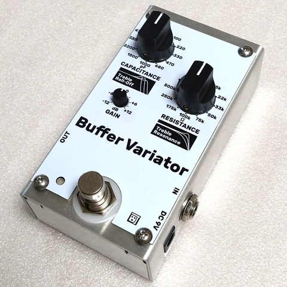
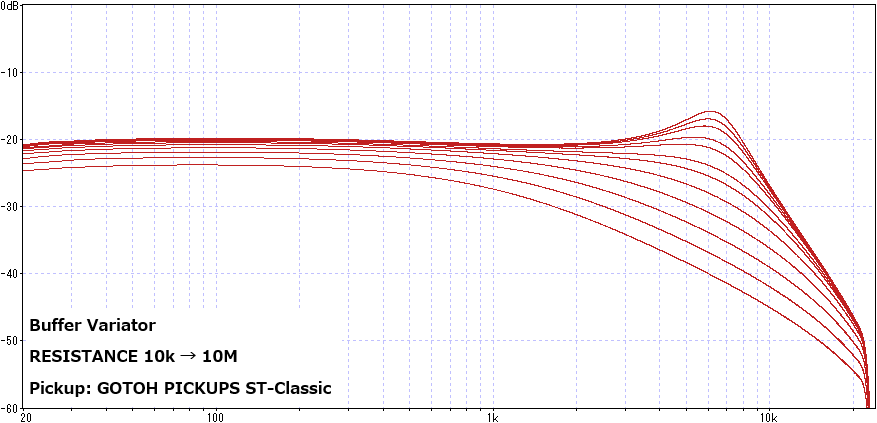
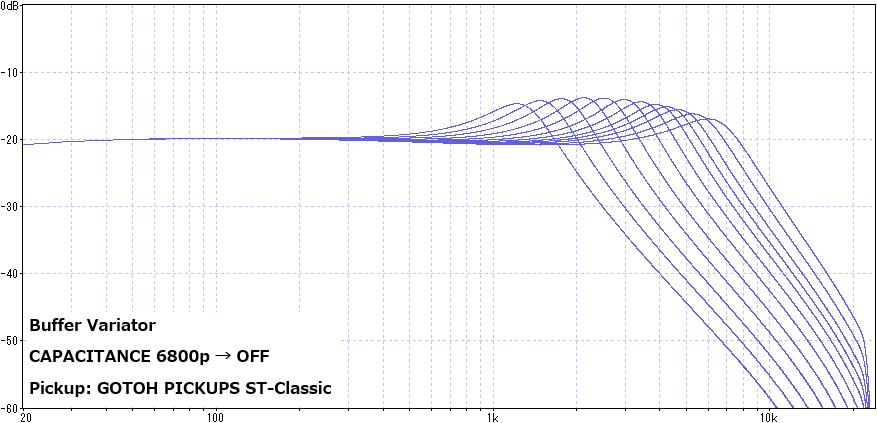

# Buffer Variator
 

ギター・ベースのピックアップで拾った音は、楽器本体のボリューム・トーンやシールドケーブル、最初に接続する機器の入力部によって音質が変化します。本機は、入力部の抵抗値と静電容量値を変化させることにより、主に高音域の音質変化をコントロールできるようにしたバッファー／ブースターです。

### 各部の機能

- INPUT 端子

  パッシブタイプのギターやベースを接続します。フルアップボリュームポットやフルアップトーンポットが搭載されていると、より効果的です。アクティブタイプの楽器や別のバッファーを介して接続した場合、音色変化がほとんどなく、GAINのみ変化します。

- OUTPUT 端子

  アンプや他の機器の入力へ接続します。

- DC9V 端子

  ACアダプターなどの電源を接続します。電源には、DC9V（センターマイナス）出力で、100mA以上の電流出力が可能なものを使用してください。

  ※ 12V以上の電源を接続した場合は、保護回路が働くため動作しません。

- フットスイッチ

  エフェクトオン／オフを切り替えます。エフェクトオフ時は、一般的なバッファー（RESISTANCE：1MΩ　CAPACITANCE：OFF　GAIN：±0dB）となります。

  ※ 一般的なトゥルーバイパスのエフェクターと同程度のスイッチングノイズがあります。

- GAIN

  音量の増減を調整します。

- RESISTANCE

  抵抗値を設定します。抵抗値が上がるほど、高音域が強調された音色になります。代表的な周波数特性変化は下図の通りです。

   ※ 10kから反時計回り、10Mから時計回りにはストッパーがあるため回りません。無理な力を加えないようご注意ください。

- CAPACITANCE

  コンデンサの静電容量を設定します。容量値が上がるほど、高音域が減衰した音色になります。ピックアップの種類によりますが、ピークレベルも少し変動します。代表的な周波数特性変化は下図の通りです。

   ※ OFFから反時計回り、6800pから時計回りにはストッパーがあるため回りません。無理な力を加えないようご注意ください。

### 使い方の例

- バッファー／ブースター／アッテネーター

  通常のイコライザーでは再現が難しい音色変化があります。音量を上げるだけでなく、下げる目的でも使用することができます。

- シールドケーブルシミュレーション

  シールドケーブルにはコンデンサのように静電容量があります。ケーブルの長さに比例して容量値が大きくなるので、短いケーブルを使用しているときに本機で容量を足すと、長いケーブルを使っているときと同じ音色にすることができます。また、使用したいケーブルの静電容量がわかっている場合、それと同じ容量になるように設定することができます。

- エフェクター入力部の再現

  一部のエフェクターでは、前段にバッファーがあると音色が変化します。そういったエフェクターの前段に使うバッファーとして本機を以下のような設定にしておくと、バッファーなしで接続したときの音をある程度再現することができます。
  
  | 機種             | RESISTANCE | CAPACITANCE |
  | ---------------- | ---------- | ----------- |
  | RAT、Distortion+ | 1M         | 1000p       |
  | Big Muff         | 50k        | OFF         |
  | Fuzz Face        | 10k        | OFF         |
  
  ※ Fuzz Faceは再現度が高くありません。

### 資料
- [Buffer Variator製作に関する記事](https://kanengomibako.github.io/00386_BufferVariator.html)
- [「ボリューム」で考える入出力インピーダンス](https://kanengomibako.github.io/pages/00301.html)
- [ギターケーブルの音への影響](https://zenn.dev/bj_9/articles/ef8c6669f2db6e)（外部サイト）

| 主な仕様 |  |
| - | - |
| 最大入力電圧 | +15.9 dBu（13.7 Vp-p） |
| 最大出力電圧 | +15.7 dBu（13.4 Vp-p） |
| 入力インピーダンス | 1 MΩ（エフェクトオフ時） |
| 出力インピーダンス | 1 kΩ |
| コントロール | エフェクトオン／オフスイッチ　RESISTANCEつまみ　CAPACITANCEつまみ　GAINつまみ |
| インジケーター | 青色LED（エフェクトオン） 暗赤色LED（エフェクトオフ） |
| 接続端子 | INPUT端子　OUTPUT端子　電源入力端子 |
| 消費電流 | 16 mA |
| 外形寸法 | 幅 63 mm × 奥行 110 mm × 高さ 51 mm （つまみ、スイッチ部を除いた高さ 34 mm） |
| 質量 | 306 g（ステンレス筐体バージョン） 196 g（アルミニウム筐体バージョン） |
