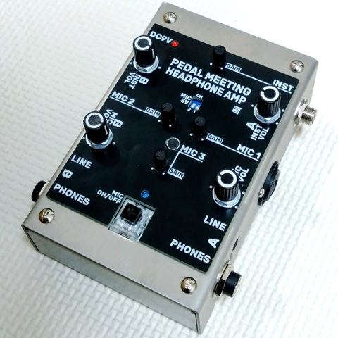

# Pedal Meeting Headphone Amp
 

エフェクター展示会の試奏ブースでのコミュニケーションを円滑にするために設計されたヘッドフォンアンプです。ギター／ベースの音と会話用のマイク音声をミックスし、ヘッドフォンで聴くことができます。試奏者と出展者が音を共有できると共に、ヘッドフォンを外さずに会話することが可能となります。

### ■ 入力

それぞれ独立したゲイン調整を備えています。ゲインを上げ過ぎるとハウリングが起こることがありますのでご注意ください。

- INST

  楽器側の音声出力を接続します。アンプ・キャビネットシミュレータからの接続を想定しています。ゲインは基本的に中央で固定し、微調整として使用してください。

- MIC1／MIC2

  外部マイクを接続します。48Vファンタム電源が必要なマイクには対応していません。

- MIC3

  本体トップ面にあるマイクです。外部マイクがない場合でも、会話を拾うことが可能です。

### ■ 出力

楽器の音とマイクの音をそれぞれ出力ボリュームで調整できます。

- PHONES A／B

  試奏者用、出展者用のヘッドフォンを接続します。

- LINE A／B

  外部録音機器を接続できます。

### ■ スイッチ

- MIC ON／OFF

  すべてのマイク入力を一括でミュートします。マイクが楽器の生音を拾うため、会話時以外はマイクをOFF（LED消灯）にすることをお勧めします。

- MIC 5V

  プラグインパワー方式のコンデンサーマイクを使用する際にONにします。ダイナミックマイク接続時はOFFにします。48Vファンタム電源が必要なマイクには対応していません。

### 資料
- [Pedal Meeting Headphone Amp製作に関する記事](https://kanengomibako.github.io/)（準備中）

| 主な仕様 |  |
| - | - |
| （準備中） | （準備中） |

